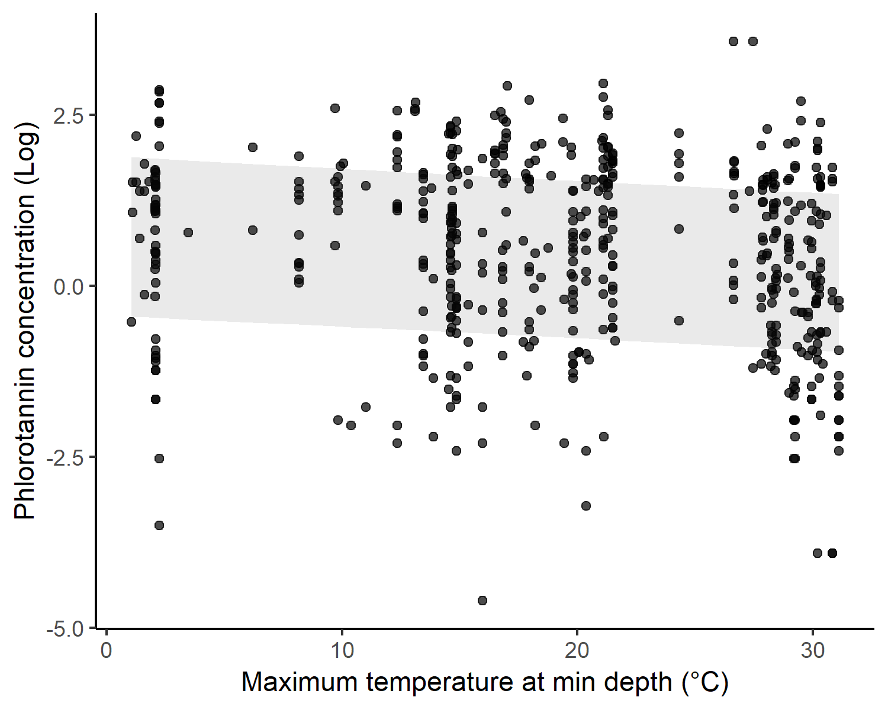

```{r setup, include=FALSE}
knitr::opts_chunk$set(echo = TRUE)
```

## Introduction

Understanding brown seaweed macroecological patterns remains a challenge. Many macroecological patterns are yet to be described and there is still a lack of mechanistic explanations for the few known patterns. For instance, evidence suggests that there is a peak of brown algae diversity in higher latitudes. Suggested explanations for such patterns rely on biogegraphical and competitive mechanisms. It has been suggested that brown algae evolved and diversified in cooler seas because of temperature tolerance. In addition, because some brown seaweed such as kelps and fucoids are considered successfull competitors in cooler seas, they might exclude green and red algal species what could generate observed patterns of global diversity. 

General patterns of brown seaweeds are also driven by the effect of herbivores. As a protection against grazing, brown seaweeds produce chemical defenses such as phenolic compounds. Because of the global pattern of distribution of brown seaweeds, higher concentrations of phenolic compounds are also found at higher latitudes (Steinberg and Paul 1990; Steinberg et al. 1991). At local scales, environmental gradients of salinity and photosynthetically active radiation are important components driving the pattern of phenolic compounds produced by brown seaweed (Hess et al. 2017).

In this studied we aimed to understand global patterns of phenolic compounds Because of regional and local effects on  

Our main goal is to understand how sea temperature affects the production of phenolic compounds by brown seaweed in different ocean regions across the globe. We confronted three hypotheses on how temperature afeccts phlorotannin concentration. 

## Methods

### Data set

We collected data from peer reviwed articles that evaluated phlorotannin concentration produced by different species of brown algae [How was the article search? Systematic search based on specific terms?]. We considered each observation as the concentration of phlorotannin produced by a particular species. From 59 references (Table S1) we evaluated a total of 528 studies. From each study, we extracted values of mean phlorotannin concentration, algae species and geographic coordinates.

Based on the assumption that high temperature values restrict the production of phlototannin bt brown algae, we represented the effect of temperature by using maximum temperature. At each study locality we extracted from Bio-Oracle (Tyberghein et al. 2012, Assis et al. 2017) sea water maximum temperature at minimum depth. 

### Statistical analysis

We used linear mixed models (LMMs) with spatial autocorrelated random effects to examine the effects of temperature and oceanic region on concentration of phlorotannin recorded at each site. In order to account for spatial autocorrelated random effects we used the procedure proposed by Rousset and Ferdy 2014 which estimates model parameters based on Laplace approximations for the likelihood with a Matérn model (Stein 1999) for spatial correlation. 

We followed the protocol of Zuur et al. (2009) to construct and test LMMs fitted to nested and hierarchical data (i.e.replicates distributed over species and publications). First, we built six LMMs using combinations of random variables and selected the model with the best random effects structure (using all fixed effects). We then used this selected random effects structure to identify the best set of fixed effects predictors (Table S2). In all models, the response variable was the mean value of phlorotannin concentration (log-transformed). Ocean region, temperature and their additive and interactive effects were tested as fixed effect predictors. The additive effects hypothesis assumes that both variables could influence phlorotannin concentration, but that these effects are
independent. The interactive effects hypothesis assumes that ocean region and temperature interact to affect phlorotannin concentration. Based on our previous random effect model selction, species and publication identities were included in models as random effects. 

All models were compared using Akaike’s information criterion (AIC), which identifies the model that is best supported by the data (Burnham and Anderson 2002). We also calculated Akaike evidence weights (wi). The best-supported model was inspected and validated by residuals analysis, which did not reveal any significant departure from model assumptions (Figure S1). All analyses were performed using R software (R Core Team 2018), with models fitted using fitme function from spaMM package (Rousset and Ferdy 2014). We calculated predicted values from models using predict.HLfit from spaMM package to take into account spatial random effects. We calculated predicted values for all temperature values across the globe assuming spatial random effects based on a correlation matrix between new locations and locations in the original fit. 

## Results

We found that phlorotannin concentration is negativelly affected by maximum temperature. Best model retained only temperature as a fixed effect (Table 1, Figure 1).


```{r, echo=FALSE}
aic_tab <- read.csv("../results/aic_tab.csv")
knitr::kable(aic_tab, caption = "Table 1. Model selection results for fixed effects of temperature (Temp), oceanic region (Ocean), and their interaction (Temp:Ocean) based on the random effect structure: random intercept effect of species and random intercept effect of study author. Models were ranked based on differences in Akaike’s information criterion (AIC). k is the number of parameters in the model and w is the Akaike weight of each model.", 
             col.names = c("Model", "$\\Delta$AIC", "k", "w", "AIC"))
```

<center>
{width=60%}
</center>


